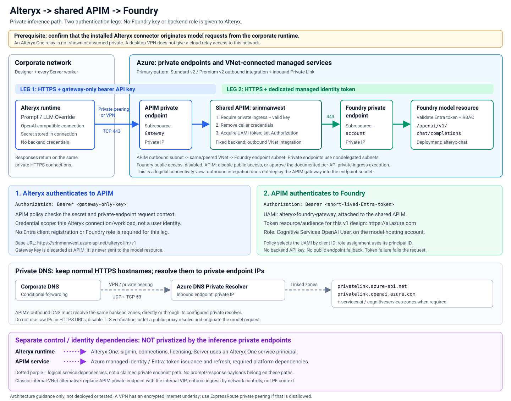

# Alteryx -> shared APIM -> Foundry: private model access

Step-by-step setup for **Alteryx Designer or Alteryx Server on the corporate
network**, connected to Azure through **ExpressRoute private peering or VPN**.
Reuse **APIM `srinmanwest` in resource group `infrarg`** from the
[existing APIM scenario](../../../azure-private/oidc/easyauth/python-learning/apim-appdemo-with-easyauth.md).

Alteryx calls a private APIM endpoint. APIM authenticates the caller, then calls
a model deployed in Microsoft Foundry through the model resource's private
endpoint, using a dedicated user-assigned managed identity (UAMI).

**Status:** configuration guidance only. No Azure resources were inspected or
changed, and no commands, policies, or end-to-end calls were tested. Product
documentation was consulted on October 4, 2026.

## 1. Scope and important prerequisites

### Model and connector selected for this guide

This guide uses:

- An **Azure OpenAI chat model deployed in Foundry**, exposed through the
  **OpenAI v1 API**. An existing Foundry resource or Azure OpenAI resource can
  provide this endpoint.
- Alteryx's **OpenAI-compatible** connection type, which explicitly supports a
  custom **Base URL** and **API Key** in
  [Create LLM Connections](https://help.alteryx.com/current/en/designer/tools/ai-tools/create-llm-connections.html).
- A gateway-only secret for **Alteryx -> APIM**.
- Microsoft Entra managed identity for **APIM -> Foundry**.

Using the OpenAI-compatible connector does **not** send traffic to public
OpenAI. Its Base URL will be the APIM URL. The API key is **not a Foundry key**,
and APIM never forwards it to Foundry.

This is not a generic recipe for every model in the Foundry catalog. A
serverless deployment, managed-compute deployment, agent endpoint, or model
that does not support OpenAI v1 Chat Completions needs its own endpoint,
identity audience, RBAC, networking, and protocol design. Do not substitute one
of those URLs into this guide.

### Confirm the actual Alteryx request origin before proceeding

The linked Alteryx setup creates connections in **Alteryx One**, even when the
workflow is authored in desktop Designer. A desktop/server installation and
corporate VPN do **not**, by themselves, prove that all AI-tool requests are
sent directly from that machine.

Have the Alteryx administrator confirm with Alteryx support, for the installed
Designer/Server and AI-tools versions:

1. Where connection validation, model discovery, and inference requests execute.
2. Whether the chosen connector sends requests directly from the corporate
   Designer/Server worker to a private custom Base URL, without relaying prompt
   or response payloads through an Alteryx-hosted service.
3. Whether its OpenAI-compatible connection supports the `/models` and
   `/chat/completions` contract below, including `Authorization: Bearer <key>`.
4. Which Alteryx One services must remain reachable for sign-in, connection
   retrieval, licensing, and scheduled execution.

**This is a prerequisite, not an assumption that the linked connector has
verified private-network support.** If an Alteryx-hosted service originates any
of those model requests, it must have a supported private connection to the
Azure network. A VPN on the desktop does not provide that connection. If the
product cannot provide the required path, stop: use an Alteryx-supported
private execution option or a separately designed local HTTP integration.
Do not publish APIM publicly or temporarily enable Foundry public access to
make connection validation succeed.

### What "all private" means here

The required **model data path** is private on both hops:



[Open the architecture diagram full size](alteryx-apim-foundry-private.svg).

**Reading the diagram:**

1. **Blue / leg 1:** Alteryx sends `Authorization: Bearer <gateway-only-key>`
   over private HTTPS to APIM. APIM checks the key and private ingress.
2. **Green / leg 2:** APIM replaces that credential with its dedicated managed
   identity's Entra token. VNet outbound connectivity carries the request to
   Foundry's private endpoint; Foundry validates the token and resource-scoped
   inference role.
3. **Dashed gray:** corporate and APIM DNS resolve normal service names to the
   private endpoint IPs. HTTPS responses return over the same connections.
4. **Dotted purple:** Alteryx One and Azure identity/platform dependencies are
   separate from inference and are not automatically private.

The equivalent APIM **internal VNet** option is described in section 4.

- A VPN encrypts traffic over an internet underlay. Choose **ExpressRoute
  private peering** if even an encrypted internet underlay is disallowed.
- Alteryx One, Microsoft Entra ID, Azure management, certificate validation,
  and APIM platform dependencies are separate from model inference. These
  services are not all made private by these two private endpoints.
- The client API key avoids an Alteryx-to-Entra token request for this model
  connection, but does not remove Alteryx One or APIM identity dependencies.
- If policy means **no public service connectivity whatsoever**, including
  control-plane services, this setup must not be represented as meeting that
  requirement. Resolve the product and platform dependencies first.
- Disable prompt/response capture and public telemetry exports. Any approved
  diagnostic export needs its own network and data-handling review.

## 2. Identity and access design

| Item | Alteryx -> APIM | APIM -> Foundry |
| --- | --- | --- |
| Credential | Dedicated gateway API key | Short-lived Entra access token |
| Credential owner | Alteryx connection owner | Dedicated APIM UAMI |
| Validator | APIM API policy | Foundry/Azure OpenAI data plane |
| Required authorization | Possession of the specific gateway key and private ingress | `Cognitive Services OpenAI User` on the model-hosting resource |
| Network path | Corporate network to APIM private ingress | APIM VNet connectivity to Foundry private endpoint |

No Easy Auth web app, daemon registration, `Daemon.Call`, or `Gateway.Invoke`
role is needed for this scenario. Those belong to the existing web-app example.
The Alteryx runtime does **not** need a Foundry role, Azure subscription access,
or a Foundry API key.

The gateway key identifies an **Alteryx connection/workload**, not an individual
user. Restrict connection sharing in Alteryx. Use separate credentials and
gateway policies for workloads that need independent revocation or attribution.
Do not trust a caller-supplied user header as proof of identity.

### Setup permissions

Use resource-scoped assignments where possible. These are administrative
permissions, not permissions to give every Alteryx user.

| Person or identity | Permission/role | Scope and purpose |
| --- | --- | --- |
| APIM administrator | `API Management Service Contributor`, or an approved narrower custom role | Existing APIM instance: configure API, backend, named values, policies, identity, and networking |
| Identity administrator | `Managed Identity Contributor` | Resource group containing the new UAMI: create/manage it |
| Administrator attaching UAMI | `Managed Identity Operator`, plus APIM write permission | UAMI: permission to assign it to APIM |
| Network administrator | `Network Contributor` | Relevant VNets, subnets, private endpoints, VPN/ExpressRoute, and resolver resources |
| DNS administrator | `Private DNS Zone Contributor`, plus required VNet link permissions | Private DNS zones and their VNet links; corporate DNS administration is separate |
| Foundry resource owner | Resource write/private-endpoint approval permissions, commonly resource-scoped `Contributor` | Model resource networking and endpoint approval |
| Model deployment administrator | `Cognitive Services OpenAI Contributor` for the Azure OpenAI deployment operations used here | Model-hosting resource; creating the resource itself also requires resource creation permissions |
| RBAC administrator | `Role Based Access Control Administrator` or `User Access Administrator`, subject to any assignment conditions | Model-hosting resource: grant the UAMI its inference role |
| **APIM UAMI at runtime** | **`Cognitive Services OpenAI User`** | **Only the Foundry/Azure OpenAI account hosting the model** |
| Alteryx Workspace Admin | Alteryx workspace administration | Manage connection access and, for Server, Alteryx One service principals |
| Alteryx connection creator | Full User or custom role with `LLM Connectivity` | Create the LLM connection |
| Alteryx workflow user | Full User or custom role with `Gen AI Tools`, plus access to the shared connection and credentials | Use Prompt/LLM Override |

Azure `Contributor` alone cannot create Azure RBAC role assignments.
Private endpoint creation and approval may be performed by different owners.

**Shared APIM warning:** a dedicated UAMI limits the permissions granted to this
workload, but is not isolation from APIM policy administrators. A person who can
edit policies can potentially use any identity attached to the gateway. Keep
policy-edit and named-value-read permissions tightly controlled.

## 3. Record the configuration values

Do not copy any secrets into this document or source control.

| Setting | Value used in this guide |
| --- | --- |
| APIM instance / resource group | `srinmanwest` / `infrarg` |
| New APIM API ID | `alteryx-llm` |
| New APIM API URL suffix | `alteryx-llm/v1` |
| Alteryx Base URL | `https://srinmanwest.azure-api.net/alteryx-llm/v1` |
| New backend ID | `alteryx-foundry-v1` |
| Model resource | `<foundry-or-openai-resource-name>` |
| Backend base URL | `https://<resource-name>.openai.azure.com/openai/v1` |
| Model deployment name | `alteryx-chat` (example; use the actual deployment name) |
| Dedicated UAMI | `alteryx-foundry-gateway` |
| Secret named value | `alteryx-gateway-key` |
| Nonsecret named value | `alteryx-foundry-uami-client-id` |

Obtain the actual endpoint from the model resource. Foundry can also expose the
v1 API through `https://<resource-name>.services.ai.azure.com/openai/v1`.
Use the hostname actually supported by your resource and configure private DNS
for that hostname. Do not use a Foundry portal URL, a project URL such as
`/api/projects/...`, or a `privatelink` hostname as the backend base URL.

## 4. Prepare the existing APIM for private ingress and egress

### 4.1 Inspect the shared instance before making changes

In the Azure portal, open `srinmanwest` in `infrarg`. Record its pricing tier,
region, VNet mode, current identities, custom domains, existing private
endpoints, and inherited policies.

The earlier APIM document does not establish its current SKU or network mode.
Use the applicable branch:

| Current APIM configuration | Suitable approach |
| --- | --- |
| **Standard v2**, or **Premium v2 using outbound VNet integration** | Inbound private endpoint **plus** outbound VNet integration. This is the primary walkthrough below. |
| **Classic Premium** | Internal VNet injection provides private gateway ingress and backend connectivity. Use its internal private VIP instead of an inbound private endpoint. |
| **Classic Developer** | Same internal VNet pattern for development only; not a production tier. |
| **Premium v2 using VNet injection** | Retain its supported private-injection design; follow the tier-specific network requirements instead of adding the integration configuration below. |
| Basic/Standard classic, Consumption, or another configuration without the required outbound capability | An inbound private endpoint alone is insufficient. The APIM owner must arrange a supported tier/network migration before this scenario can meet the requirement. Do not assume an in-place classic-to-v2 conversion is available. |

Do not attach an inbound private endpoint to a **classic VNet-injected**
instance; that combination is not supported. Do not create a second APIM as an
unannounced substitute for the shared instance.

### 4.2 Configure outbound integration: Standard v2 / Premium v2 integration

1. Select a VNet in the **same subscription and region** as APIM.
2. Create a subnet dedicated to this APIM instance. The documented minimum is
   `/27`; `/24` is recommended for scaling. It cannot host other resources.
3. Register `Microsoft.Web` if needed, and delegate the subnet to
   **`Microsoft.Web/serverFarms`**.
4. Associate an NSG. Allow DNS to the approved resolver, TCP 443 to the Foundry
   private endpoint, and the documented APIM platform dependencies, including
   the Azure Key Vault dependency. Do not blindly deny all egress.
5. In APIM, open **Network** and enable **outbound virtual network integration**
   with this VNet/subnet. Save.
6. Ensure peering, routes, DNS, and firewall rules allow this subnet to reach
   the Foundry private endpoint's VNet if it is different.

**Outbound integration does not make APIM ingress private.** Complete the next
step as well. Inbound NSG rules on this integration subnet do not control the
v2 gateway's public ingress.

### 4.3 Add private ingress

For the integration branch:

1. Create a private endpoint targeting the existing APIM resource.
2. Select the **`Gateway`** subresource.
3. Place the endpoint in a nondelegated private-endpoint subnet reachable from
   the corporate network. Do not use the outbound integration subnet.
4. Integrate with **`privatelink.azure-api.net`** and approve the connection.
5. Record the private IP and link the DNS zone to the resolver/client VNets as
   described in section 6.
6. After coordinating with **all consumers of this shared APIM**, disable APIM
   **public network access**. This setting affects the whole instance, not just
   the new API. An inbound private endpoint must exist before disabling it.

The private endpoint covers the gateway, not every APIM management or developer
portal endpoint.

For the classic internal-VNet branch:

1. Have the APIM owner configure/retain **internal** VNet mode in its dedicated
   subnet, following the classic tier's NSG, route, load-balancer, and platform
   dependency requirements.
2. Resolve the gateway hostname to its **internal private VIP** using private
   DNS. Do not invent an APIM Private Link record for this branch.
3. Route the corporate network to that VIP and APIM to the Foundry private
   endpoint. Preserve required control-plane connectivity.

### 4.4 If other teams must keep public APIs

Do **not** disable instance-wide public access without their approval.
For an inbound-private-endpoint deployment, the API policy in section 9 rejects
requests unless `context.Request.PrivateEndpointConnection` is present.
This permits the new API's authorized inference path to be private while
unrelated APIs remain public.

That is **API-level private-ingress enforcement**, not a network-disabled public
listener: a public caller can still reach APIM and receive a rejection. If
compliance requires the listener itself to be unreachable publicly, all users
of the shared instance must move to private access before public network access
is disabled. These two requirements cannot be satisfied by claiming that an
API-level policy disables the instance's public endpoint.

## 5. Configure the Foundry model and its private endpoint

1. Open the Foundry/Azure OpenAI resource that will actually serve inference.
2. Deploy a chat model supporting the OpenAI v1 Chat Completions API. Record
   its **deployment name**, not just its catalog model name. This guide uses
   `alteryx-chat` as an example.
3. Record the account's endpoint and Azure resource ID.
4. In the account's networking configuration, create a private endpoint to the
   account, using subresource **`account`**.
5. Select a nondelegated private-endpoint subnet reachable from APIM's VNet
   integration/injection subnet. Approve the endpoint connection.
6. Configure the private DNS zone group using the endpoint's generated DNS
   configuration. A Foundry account may require multiple zone entries:

   | Endpoint suffix | Private DNS zone |
   | --- | --- |
   | `openai.azure.com` | `privatelink.openai.azure.com` |
   | `services.ai.azure.com` | `privatelink.services.ai.azure.com` |
   | `cognitiveservices.azure.com` | `privatelink.cognitiveservices.azure.com` |

   Keep the generated account records; at minimum the hostname used by APIM
   must resolve privately. A private endpoint on a different hub, project
   dependency, or storage account does not privatize this inference endpoint.
7. Set the model-hosting account's **public network access to Disabled**.
   "Selected networks" or a public IP allowlist is not the private-only setting.
8. Where supported, disable local/API-key authentication on that account after
   coordinating with existing consumers. The APIM policy uses Entra tokens,
   not local keys. Removing local auth is defense in depth, not a substitute
   for private networking.

To prevent bypass, do not grant Alteryx users or runtimes inference rights on
the backend resource. If network policy also requires APIM to be the only
network source, restrict access to the Foundry endpoint to APIM's outbound
subnet and explicitly authorized admin paths. Where using NSGs/UDRs on the
private-endpoint subnet, enable the applicable private endpoint network
policies and have the network owner account for routing and return traffic.

## 6. Connect corporate routing and DNS

### Routing and firewall rules

Provide nonoverlapping address ranges and bidirectional routing over the
corporate VPN or ExpressRoute private peering.

| Source | Destination | Required access |
| --- | --- | --- |
| Corporate Designer machines and **every Server worker** | APIM private endpoint IP or internal VIP | TCP 443 |
| Corporate DNS servers | Azure DNS Private Resolver inbound endpoint | UDP and TCP 53 over the private connection |
| APIM's outbound subnet | Foundry private endpoint IP(s) | TCP 443 |
| APIM's DNS clients | Configured DNS resolver | UDP and TCP 53 |
| Approved Azure admin machines | Private services being administered | Only required private data-plane access |

Apply least-privilege firewall/NSG rules, account for gateway transit and
forwarded traffic when using hub-spoke peering, and keep routing symmetric.
Don't route the model calls through a public proxy, public Application Gateway,
Front Door, or public egress NAT.

### DNS setup

1. Deploy or reuse **Azure DNS Private Resolver**, with an inbound endpoint
   reachable from corporate DNS servers. An approved DNS forwarder VM in Azure
   is an alternative.
2. Link the APIM and Foundry private DNS zones to the VNets that resolve them:
   especially the resolver VNet and APIM's outbound VNet. Peering does not
   automatically share DNS zone links.
3. On corporate DNS, configure conditional forwarding for the applicable public
   service namespaces, such as `azure-api.net`, `openai.azure.com`, and
   `services.ai.azure.com`, to the Azure resolver's **private inbound IP**.
   This allows the public-name/CNAME lookup to complete against the private
   zones. Coordinate namespace-wide forwarding with the DNS owner.
4. If APIM uses custom VNet DNS, configure that DNS service to resolve the same
   private zones. Linking an Azure private zone does not automatically fix an
   unrelated custom resolver.
5. For classic internal APIM, maintain the private gateway A record to its
   internal VIP in the corporate/private DNS design instead of the APIM
   Private Link zone mapping.
6. Configure corporate proxy/PAC bypass for these destinations where needed.
   Otherwise a public proxy might resolve the hostname or originate the call.

Expected resolution for the primary branch:

```text
Corporate Alteryx host:
  srinmanwest.azure-api.net
    -> Private Link DNS mapping -> APIM private endpoint IP

APIM outbound DNS:
  <resource-name>.openai.azure.com
    -> Private Link DNS mapping -> Foundry private endpoint IP
```

Do not forward on-premises DNS directly to `168.63.129.16`; that Azure resolver
address is not an on-premises DNS endpoint. Use the resolver inbound endpoint.

Continue using the **normal service FQDNs in HTTPS URLs**, not raw private IPs
or `privatelink` URLs. Private DNS changes the destination IP while preserving
TLS hostname validation. Never disable certificate validation.

## 7. Create the dedicated managed identity and grant inference access

1. In Azure **Managed Identities**, create `alteryx-foundry-gateway` in an
   approved resource group.
2. Record both its **client ID** and **principal/object ID**. They are different:
   - APIM's policy uses the **client ID**.
   - The Azure RBAC assignment targets the **principal/object ID**.
3. Open APIM `srinmanwest` -> **Managed identities** -> **User assigned** ->
   **Add**, and attach this UAMI.
4. Preserve the existing system-assigned identity and all existing UAMIs.
   In particular, do not replace/remove the earlier scenario's gateway identity.
5. On the **model-hosting Foundry/Azure OpenAI resource**, open **Access control
   (IAM)** -> **Add role assignment**:
   - Role: **Cognitive Services OpenAI User**.
   - Assign access to: **Managed identity**.
   - Member: `alteryx-foundry-gateway`.
   - Scope: this model-hosting resource, not the subscription.
6. Allow time for role assignment propagation before an operational rollout.

This account-scoped role can authorize inference against deployments in that
account. If the account hosts models that Alteryx must not use, enforce a
deployment allowlist in APIM or use an appropriately separated backend account.
The model list in section 10 is for discovery; **it is not an authorization
allowlist**.

For the **v1 API chosen here**, this guide uses token resource/audience
**`https://ai.azure.com`**, following the current v1 authentication example.
In `authentication-managed-identity`, use the resource URI, **without**
`/.default`. An OAuth SDK scope would be `https://ai.azure.com/.default`.
Existing Azure OpenAI examples also use the Cognitive Services audience
`https://cognitiveservices.azure.com`; do not copy the web-app audience from the
earlier Easy Auth scenario or mix endpoint/authentication contracts.

## 8. Create the gateway credential, backend, and API

### 8.1 Named values

In APIM -> **Named values**, create:

| Name | Type | Value |
| --- | --- | --- |
| `alteryx-gateway-key` | **Secret** | New cryptographically random gateway-only key, generated using an approved secret-management tool; at least 32 random bytes |
| `alteryx-foundry-uami-client-id` | Plain | Client ID of the dedicated UAMI |

Store the gateway key only in APIM's secret named value and the protected Alteryx
connection/approved enterprise secret store. Do not place it in policy XML,
workflow text, logs, URLs, screenshots, or source control.

This is a **policy-validated gateway credential**, not a native APIM subscription
key. That distinction avoids requiring the Alteryx connector to send
`Ocp-Apim-Subscription-Key`, a custom header not exposed by the documented
OpenAI-compatible connection form.

A Key Vault-backed named value is an optional enterprise alternative. It adds
a separate dependency: authorize the identity used to retrieve the secret
(typically `Key Vault Secrets User` under the vault's RBAC model), establish
private vault connectivity/DNS, and follow the APIM tier's supported Key Vault
network configuration. Do not silently add a public secret-retrieval path.

### 8.2 Backend

In APIM -> **Backends** -> **Add**, create:

- ID/name: `alteryx-foundry-v1`.
- Type: custom backend.
- Runtime URL: `https://<resource-name>.openai.azure.com/openai/v1`.
- TLS certificate chain and name validation: enabled.
- No backend API-key credential.
- No additional backend authentication setting: the policy below supplies the
  managed identity token.

Use the actual `services.ai.azure.com` host instead if that is the endpoint
selected in section 3.

### 8.3 API and operations

In APIM -> **APIs**, create a new HTTP API:

- API ID: `alteryx-llm`.
- Display name: `Alteryx private Foundry`.
- URL suffix: `alteryx-llm/v1`.
- HTTPS only.
- **Subscription required: off for this API only.** The explicit credential
  check below is mandatory; turning this off must not create an anonymous API.
- Do not add it to a broad public product.

Create only these operations:

| Operation ID | Method | Relative URL | Purpose |
| --- | --- | --- | --- |
| `chat-completions` | POST | `/chat/completions` | Proxy to Foundry |
| `list-models` | GET | `/models` | Return the curated deployment list |

Do not create a wildcard route or expose authoring, deployment-management,
files, fine-tuning, or agent operations as part of this setup.

## 9. Apply the API-level policy

Review existing global/product policies before adding this API. Preserve shared
logging protections, error handling, and governance. An inherited policy that
requires the earlier scenario's JWT audience will reject this connector's
gateway key: have the APIM owner scope that requirement to its intended APIs.
Do not remove `<base />` merely to bypass shared controls.

Apply the following policy at the **new API's All operations scope**, not the
global scope or another team's API. The first check assumes the **inbound
private endpoint** branch:

```xml
<policies>
  <inbound>
    <choose>
      <when condition="@(context.Request.PrivateEndpointConnection == null)">
        <return-response>
          <set-status code="403" reason="Forbidden" />
          <set-body>Private endpoint access is required.</set-body>
        </return-response>
      </when>
    </choose>
    <check-header name="Authorization"
                  failed-check-httpcode="401"
                  failed-check-error-message="Invalid gateway credential."
                  ignore-case="false">
      <value>Bearer {{alteryx-gateway-key}}</value>
    </check-header>
    <base />
    <set-header name="Authorization" exists-action="delete" />
    <set-header name="api-key" exists-action="delete" />
    <set-header name="Ocp-Apim-Subscription-Key" exists-action="delete" />
    <set-backend-service backend-id="alteryx-foundry-v1" />
    <authentication-managed-identity
        resource="https://ai.azure.com"
        client-id="{{alteryx-foundry-uami-client-id}}"
        output-token-variable-name="foundry-access-token"
        ignore-error="false" />
    <set-header name="Authorization" exists-action="override">
      <value>@("Bearer " + (string)context.Variables["foundry-access-token"])</value>
    </set-header>
  </inbound>
  <backend>
    <base />
  </backend>
  <outbound>
    <base />
  </outbound>
  <on-error>
    <base />
  </on-error>
</policies>
```

For **internal VNet injection without a private endpoint**, omit only the first
`<choose>` block: that context property is null on internal-VIP requests too.
Private ingress must instead be enforced by the internal network topology,
DNS, and firewall rules. Keep the credential check and the rest of the policy.
Do not remove that check for a publicly reachable integration-mode gateway.

The policy:

1. Requires private-endpoint ingress for the primary branch.
2. Validates the gateway-only credential.
3. Runs inherited controls.
4. Removes caller credentials.
5. Selects the fixed Foundry backend.
6. Acquires a token using the dedicated UAMI and replaces `Authorization`.
7. Fails the request if token acquisition fails; it does not fall back to a key.

The effective backend policy must forward the request **once**. Normally the
inherited policy provides `forward-request`. If your instance has no inherited
forwarding policy, have the owner add one at the appropriate scope. For
streaming, configure the effective `forward-request` with
`buffer-response="false"` and compatible timeouts; don't add a second forward
operation or automatic retries that can duplicate billable inference.

Add an agreed request/token budget for this workload at this API's scope before
production. Do not key quotas on the backend managed identity token, which is
shared and rotates. Account for Alteryx sending one request per input row and
for concurrent Server workers.

## 10. Configure model discovery and URL mapping

Alteryx's model selector may need an OpenAI-compatible model list. Rather than
granting the caller Azure management access to enumerate deployments, return
the configured deployment names from APIM.

Apply this **operation-level** policy to `list-models`, replacing `alteryx-chat`
with the real deployment name:

```xml
<policies>
  <inbound>
    <base />
    <return-response>
      <set-status code="200" reason="OK" />
      <set-header name="Content-Type" exists-action="override">
        <value>application/json</value>
      </set-header>
      <set-body>{"object":"list","data":[{"id":"alteryx-chat","object":"model","created":0,"owned_by":"organization"}]}</set-body>
    </return-response>
  </inbound>
  <backend>
    <base />
  </backend>
  <outbound>
    <base />
  </outbound>
  <on-error>
    <base />
  </on-error>
</policies>
```

The operation inherits the API's private-ingress and credential checks before
returning the list. With the policy layout above it also acquires a managed
identity token, but does not call the model. Keep this list aligned with actual
deployments. It is a declared catalog, not a health check or proof of backend
authorization.

`chat-completions` inherits the API policy and forwards the unchanged JSON body.
Do not attach the model-list return policy to it.

| Item | Exact shape |
| --- | --- |
| Alteryx Base URL | `https://srinmanwest.azure-api.net/alteryx-llm/v1` |
| Alteryx chat request | `POST /alteryx-llm/v1/chat/completions` |
| APIM backend request | `POST https://<resource-name>.openai.azure.com/openai/v1/chat/completions` |
| Model field in JSON | `"model": "alteryx-chat"` |
| Model discovery request | `GET /alteryx-llm/v1/models` |

APIM removes its API URL suffix when constructing the backend request and
appends the operation path to the configured backend base. No rewrite is needed
for these matching paths. Review inherited rewrite policies so they do not
change this mapping.

This is the **v1** API: no dated `api-version` query parameter or
`/deployments/<name>` path is required. Do not mix it with the older Azure
OpenAI deployment-path API.

Illustrative payload shape, **not a test executed for this guide**:

```json
{
  "model": "alteryx-chat",
  "messages": [
    {
      "role": "user",
      "content": "Summarize the supplied business data."
    }
  ]
}
```

Use only model-supported parameters in Alteryx. For example, output-token and
temperature options can differ by model.

## 11. Create the Alteryx connection

After the request-origin prerequisite in section 1 has been resolved:

1. Sign in to the appropriate **Alteryx One** workspace.
2. Open **Data -> Connections -> New Connection**.
3. Filter for LLMs and choose **OpenAI-compatible**, not the fixed OpenAI
   connection and not the native Azure AI Foundry connection.
4. Enter:

   | Field | Value |
   | --- | --- |
   | Connection Name | `Private Foundry via srinmanwest` |
   | Connection Description | `Corporate private path to APIM; APIM uses managed identity for Foundry.` |
   | Credential Type | `API Key` |
   | Base URL | `https://srinmanwest.azure-api.net/alteryx-llm/v1` |
   | API Key | Raw value of `alteryx-gateway-key`, **without** a `Bearer ` prefix |

5. Save the connection. If the UI requires connection validation before saving,
   its execution path must satisfy the same private routing and DNS
   prerequisites. A public-cloud validation failure is not a reason to open
   either Azure resource to the internet.
6. Share the connection and credential-use access only with approved users or
   the Server service principal, following Alteryx's sharing model.
7. In Designer, select the correct Alteryx One workspace/Alteryx Link.
8. Add **Prompt** or **LLM Override** and select this connection.
9. Select the actual deployment name, for example `alteryx-chat`. With LLM
   Override, connect its model output to the Prompt tool's model input.
10. Configure the prompt, input columns, and supported model parameters.

There is no Azure tenant ID, Azure client secret, or Foundry API key to enter
for this **OpenAI-compatible API-key** design.

The native **Azure AI Foundry** connector in the linked article also offers
OAuth client credentials. It is a different configuration, including its own
endpoint/version/model-list fields and OAuth setup. If corporate policy
requires Entra authentication on **both** hops, design a separate
Alteryx-to-APIM audience/app-role validation flow and confirm the connector
supports that custom audience and private execution. Do not paste a short-lived
access token into the API Key field or grant Alteryx backend rights just to
avoid configuring the gateway.

## 12. Additional setup for Alteryx Server

Follow the version-specific
[Use AI Tools on Server](https://help.alteryx.com/current/en/designer/tools/ai-tools/use-ai-tools-on-server.html)
guide. The page consulted targets **Server 2026.1**; do not assume older versions
have identical connection and unattended-authentication behavior.

1. Enable AMP in Server's engine settings as required by the Alteryx guide.
2. Have a Workspace Admin create an **Alteryx One service principal** under
   **Workspace Admin -> Service Principals**.
3. Give it the required Full User/custom `Gen AI Tools` capability.
4. Share the LLM connection with that service principal, including **Share
   Credentials** and the connection role required by the installed release.
   The current Server walkthrough uses **Editor (or the required role)**.
5. In Designer's Prompt/LLM Override configuration, choose **Service Principal
   (for Server)**.
6. Create the DCM connection using **Alteryx One OAuth Application** and the
   Alteryx One service principal's client ID and secret.
7. Publish the workflow using the supported DCM/Server connection distribution
   process for your release.
8. Ensure every possible Server worker has the corporate private routes,
   private DNS resolution, TLS trust, and proxy bypass, not just the desktop
   that published the workflow.
9. Track and rotate the Alteryx One service principal secret independently of
   the gateway key.

This is an **Alteryx One identity**, not the Azure managed identity or an Entra
app registration. It enables unattended access to the Alteryx-managed
connection; it does not grant any Foundry role.

## 13. Operational controls and handoff

### Secrets, policy, and logging

- Restrict access to APIM policy editing, named values, and Alteryx connection
  sharing. A private network is not a replacement for authentication.
- Rotate the gateway key on schedule. For a controlled overlap, temporarily
  allow both old and new `Bearer {{named-value}}` values in `check-header`;
  update Alteryx, then remove/revoke the old value. Keep both values secret.
- Never log `Authorization`, `api-key`, APIM subscription keys, model access
  tokens, or sensitive request/response bodies. Review inherited diagnostics
  before use.
- Log sanitized request IDs, operation names, status, latency, and permitted
  usage counts only. Keep failure reporting visible; do not turn backend
  authorization or network failures into successful empty model responses.
- If using Azure Monitor/Application Insights/Log Analytics, design supported
  private ingestion/query connectivity separately, using Azure Monitor Private
  Link Scope where applicable. Two inference private endpoints do not make
  those exports private.
- Protect model data residency separately: private transport does not change
  the processing geography of a Global, Data Zone, or regional model deployment.
- Do not enable automatic fallback to public OpenAI, another public model
  provider, or the Foundry public endpoint on failures.

### Acceptance criteria for the implementation owner

These are future rollout criteria, **not checks performed while writing this
document**:

- Alteryx's documented/supported request origin is private for validation,
  discovery, and inference; prompt payloads are not relayed over a public path.
- Corporate clients resolve APIM to its private endpoint IP/internal VIP.
- APIM resolves the selected Foundry hostname to the Foundry private endpoint.
- All Alteryx workers use the required VPN/ExpressRoute path, without public
  proxy fallback.
- Foundry public network access is disabled.
- APIM public network access is disabled, or the approved shared-instance
  exception uses API-level private-endpoint enforcement with its limitation
  explicitly accepted.
- Missing or wrong gateway credentials are rejected before model invocation.
- Only the dedicated UAMI has the intended backend inference permissions;
  Alteryx is not given backend credentials or roles.
- Chat operation path and model name match the deployed model's v1 contract.
- Existing APIM APIs, identities, policies, and network consumers are preserved.
- Secret rotation, quota ownership, sanitized diagnostics, and private telemetry
  requirements have named operational owners.

### Troubleshooting reference

| Symptom | Likely area to investigate |
| --- | --- |
| Alteryx cannot save/validate a connection, although desktop routing exists | Validation may originate in Alteryx-hosted infrastructure; resolve the section 1 prerequisite |
| DNS returns a public IP | Corporate conditional forwarding, private zone links, APIM custom DNS, or proxy-side resolution |
| Timeout before APIM | VPN/ExpressRoute route, endpoint approval, firewall, NSG, proxy, or asymmetric routing |
| APIM returns the private-endpoint 403 | Request used public ingress, or the private-endpoint guard was incorrectly used for internal VNet injection |
| APIM returns `Invalid gateway credential` | Wrong key, missing bearer header, or double `Bearer ` prefix |
| APIM returns a JWT audience error | An inherited policy still expects the earlier scenario's client token |
| Backend returns 401/403 | Wrong UAMI client ID, unattached identity, wrong role/scope, token audience, RBAC propagation, or backend network configuration |
| APIM reports backend connection failure | Foundry private DNS, APIM outbound VNet connectivity, NSG/UDR, or TLS hostname |
| Backend returns 404 | Wrong base path, duplicated `/v1`, wrong endpoint family, or incorrect deployment name |
| Model dropdown is empty | `/models` discovery contract, inherited policy failure, or Alteryx connection compatibility |
| Backend returns 400 | Unsupported model parameters or request shape; inspect sanitized error details |
| 429 or long execution times | Model quota, gateway quota, row count, worker concurrency, or retries |

## References

- [Alteryx: Create LLM Connections](https://help.alteryx.com/current/en/designer/tools/ai-tools/create-llm-connections.html)
- [Alteryx: AI Tools](https://help.alteryx.com/current/en/designer/tools/ai-tools.html)
- [Alteryx: Prompt Tool](https://help.alteryx.com/current/en/designer/tools/ai-tools/prompt-tool.html)
- [Alteryx: Use AI Tools on Server](https://help.alteryx.com/current/en/designer/tools/ai-tools/use-ai-tools-on-server.html)
- [APIM inbound private endpoints and limitations](https://learn.microsoft.com/azure/api-management/private-endpoint)
- [APIM outbound VNet integration](https://learn.microsoft.com/azure/api-management/integrate-vnet-outbound)
- [APIM classic internal VNet mode](https://learn.microsoft.com/azure/api-management/api-management-using-with-internal-vnet)
- [APIM Premium v2 VNet injection](https://learn.microsoft.com/azure/api-management/inject-vnet-v2)
- [Foundry private endpoint configuration](https://learn.microsoft.com/azure/ai-foundry/how-to/configure-private-link)
- [Private endpoint DNS zone values](https://learn.microsoft.com/azure/private-link/private-endpoint-dns)
- [Private endpoint DNS integration, including on-premises resolution](https://learn.microsoft.com/azure/private-link/private-endpoint-dns-integration)
- [OpenAI v1 API and authentication](https://learn.microsoft.com/azure/foundry/openai/api-version-lifecycle)
- [Azure OpenAI roles](https://learn.microsoft.com/azure/ai-foundry/openai/how-to/role-based-access-control)
- [APIM authentication to model APIs](https://learn.microsoft.com/azure/api-management/api-management-authenticate-authorize-azure-openai)
- [APIM managed identity policy](https://learn.microsoft.com/azure/api-management/authentication-managed-identity-policy)
- [APIM header validation policy](https://learn.microsoft.com/azure/api-management/check-header-policy)
- [APIM policy expressions and private endpoint request context](https://learn.microsoft.com/azure/api-management/api-management-policy-expressions)
- [APIM secret named values](https://learn.microsoft.com/azure/api-management/api-management-howto-properties)
