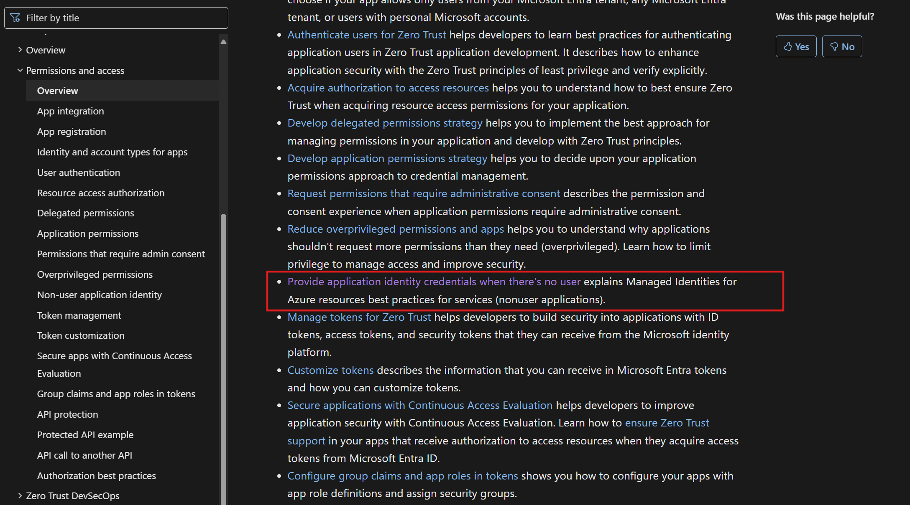
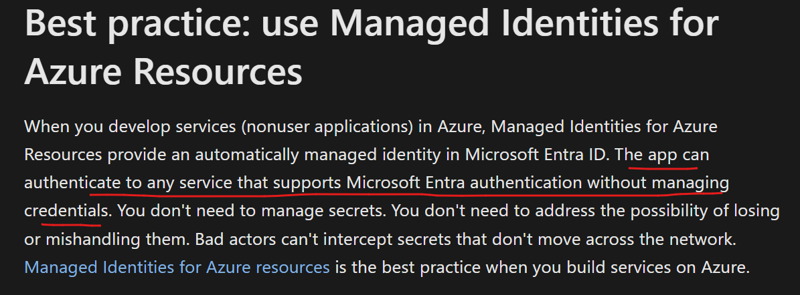
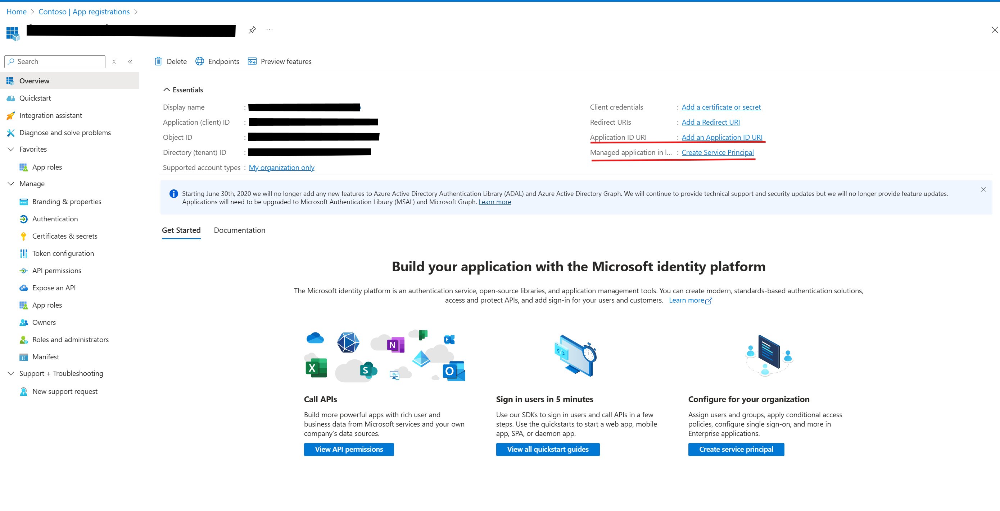
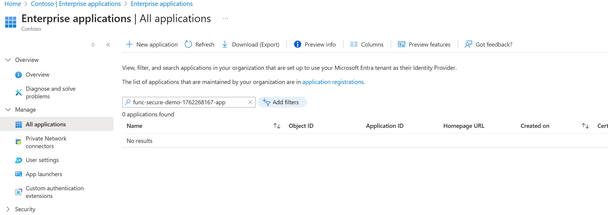
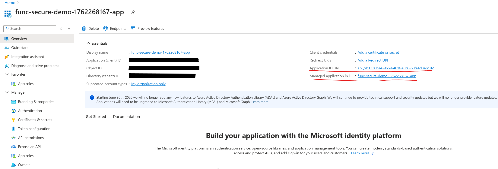

# VM to Function App Authentication with Managed Identity

This guide demonstrates how to deploy a Linux Ubuntu VM with a user-assigned managed identity that authenticates to an Azure Function App running Python code, with the Function App configured to accept calls only from that specific managed identity.

**🔒 Security Note:** This implementation uses **managed identities for storage access** (no storage keys) and **Azure Bastion for secure VM access** (no public IPs), following best practices for organizations that require secure infrastructure.

## Architecture Overview

```
┌─────────────────────────────────────────────────┐
│  Azure Bastion (Developer SKU) 🔒              │
│  - Secure SSH/RDP without public IPs           │
│  - Cost-effective for dev/test scenarios       │
└─────────────────────────────────────────────────┘
                    │ SSH Tunnel
                    ▼
┌─────────────────────────────────────────────────┐
│  Linux Ubuntu VM (D2s_v3) - NO PUBLIC IP 🔒   │
│  ┌────────────────────────────────────┐        │
│  │  User-Assigned Managed Identity     │        │
│  │  (id-vm-to-function)                │        │
│  │  - Gets access token from IMDS      │        │
│  │  - Authenticates to Function App    │        │
│  └────────────────────────────────────┘        │
└─────────────────────────────────────────────────┘
                    │
                    │ HTTPS with Bearer Token
                    ▼
┌─────────────────────────────────────────────────┐
│  Azure Function App (Python)                    │
│  ┌────────────────────────────────────┐        │
│  │  Code-Based JWT Validation         │        │
│  │  - Validates JWT signature          │        │
│  │  - Checks expiration, audience      │        │
│  │  - Validates client ID match        │        │
│  │  - No Easy Auth required!           │        │
│  └────────────────────────────────────┘        │
│  ┌────────────────────────────────────┐        │
│  │  Storage Access (No Keys) 🔒       │        │
│  │  User-Assigned Managed Identity     │        │
│  │  (func-host-storage-user)           │        │
│  │  - Storage Blob Data Owner role     │        │
│  └────────────────────────────────────┘        │
└─────────────────────────────────────────────────┘
                    │
                    │ Managed Identity Auth
                    ▼
┌─────────────────────────────────────────────────┐
│  Storage Account                                │
│  - Shared key access: DISABLED 🔒              │
│  - Access via managed identity only             │
└─────────────────────────────────────────────────┘
```

## Reference  

https://learn.microsoft.com/en-us/security/zero-trust/develop/identity   

https://learn.microsoft.com/en-us/security/zero-trust/develop/identity-non-user-applications     
   
   

https://learn.microsoft.com/en-us/security/zero-trust/develop/protect-api  

**Authentication Approach:** This guide uses `.default` scope for authentication with the App Registration's App ID. This provides simple setup while maintaining strong security through JWT validation and client ID checking in your code.

## Authentication with .default Scope

This implementation uses the `.default` scope with the App Registration's App ID for managed identity authentication:

✅ **Simple setup** - Create App Registration and request tokens with `<APP_ID>/.default`  
✅ **JWT validation** - Validates tokens using Azure AD's public keys  
✅ **Client ID validation** - Only allows specific managed identities  
✅ **Strong security** - Full control over authentication logic in your code  

### How it works:

```bash
# 1. Create App Registration
# 2. Request token with: resource=<APP_ID>/.default
# 3. Validate JWT signature, expiration, audience, and client_id in your code
```

**Security:** Authorization is enforced in your application code by validating the client ID claim in the JWT token.

---

## Prerequisites

- Azure CLI installed and logged in (`az login`)
- Appropriate permissions to create resources
- Python 3.8+ installed locally (for testing Function App)
- **jq** JSON processor installed (`sudo apt-get install jq` on Ubuntu)
- Basic knowledge of Azure resources
- Organization policy that allows managed identity for storage access

---

## Step 1: Set Environment Variables

First, define your environment variables for consistent naming:

```bash
# Set your variables
RESOURCE_GROUP="rg-vm-function-demo"
LOCATION="eastus2"
VM_NAME="vm-ubuntu-demo"
VM_SIZE="Standard_D2s_v3"  # 2 vCPUs, 8 GB RAM
MANAGED_IDENTITY_NAME="id-vm-to-function"
FUNC_STORAGE_IDENTITY_NAME="func-host-storage-user"  # Standard name for function storage identity
FUNCTION_APP_NAME="func-secure-demo-$(date +%s)"  # Must be globally unique
STORAGE_ACCOUNT_NAME="stfunc$(date +%s | tail -c 8)"  # Must be globally unique
VNET_NAME="vnet-demo"
SUBNET_NAME="subnet-vm"
NSG_NAME="nsg-vm"
BASTION_NAME="bastion-demo"

# Display the values
echo "Resource Group: $RESOURCE_GROUP"
echo "VM Managed Identity: $MANAGED_IDENTITY_NAME"
echo "Function Storage Identity: $FUNC_STORAGE_IDENTITY_NAME"
echo "Function App: $FUNCTION_APP_NAME"
echo "Storage Account: $STORAGE_ACCOUNT_NAME"
echo "Bastion Host: $BASTION_NAME"
```

---

## Step 2: Create Resource Group

```bash
# Create the resource group
az group create \
  --name $RESOURCE_GROUP \
  --location $LOCATION

echo "✅ Resource group created: $RESOURCE_GROUP"
```

---

## Step 3: Create User-Assigned Managed Identity

```bash
# Create the user-assigned managed identity
az identity create \
  --name $MANAGED_IDENTITY_NAME \
  --resource-group $RESOURCE_GROUP \
  --location $LOCATION

# Get the identity details (we'll need these later)
IDENTITY_ID=$(az identity show \
  --name $MANAGED_IDENTITY_NAME \
  --resource-group $RESOURCE_GROUP \
  --query id -o tsv)

IDENTITY_CLIENT_ID=$(az identity show \
  --name $MANAGED_IDENTITY_NAME \
  --resource-group $RESOURCE_GROUP \
  --query clientId -o tsv)

IDENTITY_PRINCIPAL_ID=$(az identity show \
  --name $MANAGED_IDENTITY_NAME \
  --resource-group $RESOURCE_GROUP \
  --query principalId -o tsv)

echo "✅ Managed Identity Created"
echo "   Identity ID: $IDENTITY_ID"
echo "   Client ID: $IDENTITY_CLIENT_ID"
echo "   Principal ID: $IDENTITY_PRINCIPAL_ID"
```

---

## Step 4: Create Virtual Network with Subnets

```bash
# Create virtual network with VM subnet
az network vnet create \
  --name $VNET_NAME \
  --resource-group $RESOURCE_GROUP \
  --location $LOCATION \
  --address-prefix 10.0.0.0/16 \
  --subnet-name $SUBNET_NAME \
  --subnet-prefix 10.0.1.0/24

# Create Azure Bastion subnet (required name and minimum /26 prefix)
az network vnet subnet create \
  --name AzureBastionSubnet \
  --vnet-name $VNET_NAME \
  --resource-group $RESOURCE_GROUP \
  --address-prefix 10.0.2.0/26

# Create Network Security Group for VM subnet
az network nsg create \
  --name $NSG_NAME \
  --resource-group $RESOURCE_GROUP \
  --location $LOCATION

# Allow outbound HTTPS (for accessing Function App and Azure services)
az network nsg rule create \
  --name AllowHTTPS \
  --nsg-name $NSG_NAME \
  --resource-group $RESOURCE_GROUP \
  --priority 1001 \
  --direction Outbound \
  --source-address-prefixes '*' \
  --destination-port-ranges 443 \
  --protocol Tcp \
  --access Allow

# Associate NSG with VM subnet
az network vnet subnet update \
  --name $SUBNET_NAME \
  --vnet-name $VNET_NAME \
  --resource-group $RESOURCE_GROUP \
  --network-security-group $NSG_NAME

echo "✅ Virtual network and subnets created"
```

---

## Step 5: Create Azure Bastion (Developer SKU)

**Note:** Azure Bastion Developer SKU is the most cost-effective option for development/testing. It allows secure RDP/SSH access without public IPs.

```bash
# Create Bastion host with Developer SKU (cheapest option)
BASTION_NAME="bastion-demo"

az network bastion create \
  --name $BASTION_NAME \
  --resource-group $RESOURCE_GROUP \
  --vnet-name $VNET_NAME \
  --location $LOCATION \
  --sku Developer \
  --enable-tunneling true

echo "✅ Azure Bastion created (Developer SKU)"
echo "   Name: $BASTION_NAME"
echo "   SKU: Developer (most cost-effective)"
echo "   Tunneling: Enabled (for SSH access)"
```

**Developer SKU Features:**
- ✅ **Lowest cost** - Significantly cheaper than Basic/Standard SKUs
- ✅ **SSH tunneling** - Connect via Azure CLI
- ✅ **No public IPs needed** - VMs stay completely private
- ⚠️ **Limitation** - Only supports 2 concurrent connections
- ⚠️ **Best for** - Development, testing, and demo scenarios

---

## Step 6: Create Ubuntu VM without Public IP

```bash
# Create the VM with user-assigned managed identity (NO public IP)
az vm create \
  --name $VM_NAME \
  --resource-group $RESOURCE_GROUP \
  --location $LOCATION \
  --image Ubuntu2204 \
  --size $VM_SIZE \
  --admin-username azureuser \
  --generate-ssh-keys \
  --vnet-name $VNET_NAME \
  --subnet $SUBNET_NAME \
  --nsg $NSG_NAME \
  --assign-identity $IDENTITY_ID \
  --public-ip-address ""

echo "✅ VM Created (without public IP)"
echo "   VM Name: $VM_NAME"
echo "   Access: Via Azure Bastion only"
echo "   Private IP: Use 'az vm show' to get private IP if needed"
```

---

## Step 6: Create Storage Account for Function App (Without Storage Keys)

**Important**: This follows the secure approach for organizations that prevent storage key usage.

```bash
# Create storage account with shared key access disabled
az storage account create \
  --name $STORAGE_ACCOUNT_NAME \
  --resource-group $RESOURCE_GROUP \
  --location $LOCATION \
  --sku Standard_LRS \
  --allow-blob-public-access false \
  --allow-shared-key-access false

echo "✅ Storage account created: $STORAGE_ACCOUNT_NAME (without shared key access)"
```

---

## Step 7: Create Function App with Managed Identity for Storage Access

**Important**: The Function App will use managed identity to access storage instead of storage keys.

```bash
# Step 7a: Create user-assigned managed identity for Function App storage access
FUNC_STORAGE_IDENTITY_NAME="func-host-storage-user"

az identity create \
  --name $FUNC_STORAGE_IDENTITY_NAME \
  --resource-group $RESOURCE_GROUP \
  --location $LOCATION

# Step 7b: Get identity details
output=$(az identity show \
  --name $FUNC_STORAGE_IDENTITY_NAME \
  --resource-group $RESOURCE_GROUP \
  --query "{userId:id, principalId: principalId, clientId: clientId}" -o json)

FUNC_STORAGE_USER_ID=$(echo $output | jq -r '.userId')
FUNC_STORAGE_PRINCIPAL_ID=$(echo $output | jq -r '.principalId')
FUNC_STORAGE_CLIENT_ID=$(echo $output | jq -r '.clientId')

echo "Storage Identity Created:"
echo "  Client ID: $FUNC_STORAGE_CLIENT_ID"
echo "  Principal ID: $FUNC_STORAGE_PRINCIPAL_ID"

# Step 7c: Assign Storage Blob Data Owner role to the managed identity
STORAGE_ID=$(az storage account show \
  --resource-group $RESOURCE_GROUP \
  --name $STORAGE_ACCOUNT_NAME \
  --query 'id' -o tsv)

az role assignment create \
  --assignee-object-id $FUNC_STORAGE_PRINCIPAL_ID \
  --assignee-principal-type ServicePrincipal \
  --role "Storage Blob Data Owner" \
  --scope $STORAGE_ID

echo "✅ Storage role assigned to managed identity"

# Step 7d: Create Function App using Flex Consumption plan with managed identity
#          UAMI used here is for authenticating with storage account.  It is not used for any other purposes.  
#          Rest of the Step 7 are all for the same reason. To force Function app to use UAMI for storage access
az functionapp create \
  --resource-group $RESOURCE_GROUP \
  --flexconsumption-location $LOCATION \
  --runtime python \
  --runtime-version 3.11 \
  --storage-account $STORAGE_ACCOUNT_NAME \
  --name $FUNCTION_APP_NAME \
  --deployment-storage-auth-type UserAssignedIdentity \
  --deployment-storage-auth-value $FUNC_STORAGE_IDENTITY_NAME

echo "✅ Function App created: $FUNCTION_APP_NAME"

# Step 7e: Configure AzureWebJobsStorage with managed identity
az functionapp config appsettings set \
  --name $FUNCTION_APP_NAME \
  --resource-group $RESOURCE_GROUP \
  --settings AzureWebJobsStorage__accountName=$STORAGE_ACCOUNT_NAME \
  AzureWebJobsStorage__credential=managedidentity \
  AzureWebJobsStorage__clientId=$FUNC_STORAGE_CLIENT_ID

# Step 7f: Remove the connection string setting (forces managed identity usage)
az functionapp config appsettings delete \
  --name $FUNCTION_APP_NAME \
  --resource-group $RESOURCE_GROUP \
  --setting-names AzureWebJobsStorage 2>/dev/null || true

# Get the Function App URL
FUNCTION_APP_URL="https://${FUNCTION_APP_NAME}.azurewebsites.net"

echo "✅ Function App configured with managed identity for storage"
echo "   URL: $FUNCTION_APP_URL"
echo "   Storage Access: Managed Identity (no keys)"
```

---

## Step 8: Configure Function App for Code-Based Authentication

**Important:** Managed identities need to request tokens from Entra ID for a specific resource. We create an **Azure AD App Registration to define a resource in Entra ID** that represents our Function App API. This allows the VM's managed identity to request tokens with the correct audience claim. We will use **code-based JWT validation** instead of Easy Auth for better control and debugging.

```bash
# Step 8a: Create Azure AD App Registration for the Function App API (Resource)
#          It's important to note that Function App is unaware of this App reg and service principal.  
echo "Creating Azure AD App Registration for Function App API..."

# Get tenant ID
TENANT_ID=$(az account show --query tenantId -o tsv)

# Create app registration (represents the Function App API resource)
APP_REG_NAME="${FUNCTION_APP_NAME}-app"
APP_ID=$(az ad app create \
  --display-name $APP_REG_NAME \
  --sign-in-audience AzureADMyOrg \
  --query appId -o tsv)

echo "✅ App Registration created (Function App API Resource)"
echo "   App ID: $APP_ID"
echo $APP_REG_NAME 
```
State of objects in EntraID before spn creation 



```bash
# Step 8b: Set the Application ID URI (required for managed identity token requests)
az ad app update --id $APP_ID --identifier-uris "api://${APP_ID}"

echo "✅ Application ID URI set: api://${APP_ID}"


# Note: With .default scope, you can use either:
# - api://{APP_ID}/.default (standard format)
# - {APP_ID}/.default (shortened format - Azure accepts both)
# We'll use the APP_ID directly for simplicity

# About Application ID URI formats:
# ✅ api://{APP_ID} (used here)
#    - Microsoft's recommended default
#    - Simple, unique, guaranteed to not conflict
#    - No DNS requirements
#    - Works immediately
#
# Alternative: https://{verified-domain}/{path}
#    - Requires verified domain in Entra ID tenant
#    - Looks like a "real" API URL
#    - Common for public-facing APIs
#    - Must match verified domains in your tenant

# Step 8c: Create Service Principal for the App Registration (API Resource)
# NOTE: When using Azure Portal, the Service Principal is auto-created.
# When using Azure CLI, you must explicitly create it with 'az ad sp create'.
# This is required for token requests to work - Entra ID needs the Service Principal
# to recognize api://{APP_ID} as a valid resource in your tenant.
# APP_ID is the application id of the app we just created 
SP_ID=$(az ad sp create --id $APP_ID --query id -o tsv)

echo "✅ Service Principal created (for Function App API Resource)"
echo "   Service Principal Object ID: $SP_ID"
echo "   Note: This SP represents the API resource, NOT the VM identity"
```
  


```bash
# Step 8d: Set environment variables for code-based JWT validation
#          Let's pass APP_ID of app reg we created and ClientID of VM's managed identity to Function App
#          Again,  Azure Function App resource has not been defined with APP_ID,   APP_ID is passed to the python program to let it validate audience claim - code snippet below 
#               expected_audiences = [f'api://{app_id}', app_id]
az functionapp config appsettings set \
  --name $FUNCTION_APP_NAME \
  --resource-group $RESOURCE_GROUP \
  --settings \
    TENANT_ID=$TENANT_ID \
    APP_ID=$APP_ID \
    ALLOWED_CLIENT_ID=$IDENTITY_CLIENT_ID

echo "✅ Environment variables configured:"
echo "   TENANT_ID: $TENANT_ID"
echo "   APP_ID (API Resource): $APP_ID"
echo "   ALLOWED_CLIENT_ID (VM Identity): $IDENTITY_CLIENT_ID"
```


**Important notes**
- ✅ **Full control** over authorization logic
- ✅ **Flexible validation** - can validate any claims you want
- ✅ **No platform dependencies** - pure Python code - security is intact when moved to a different hosting platform

---

## Step 8e (OPTIONAL): Create Test Service Principal for Local Testing

THIS STEP (8a) CAN BE SKIPPED IF VM IS USED FOR VALIDATION (or for calling Function App)   

If you want to test the Function App from your laptop without VM setup, create a dedicated test service principal. **You'll use this after deploying the function code in Step 9.**

```bash
# Create a test app registration and service principal
TEST_APP_NAME="test-caller-${FUNCTION_APP_NAME}"
TEST_APP_ID=$(az ad app create --display-name $TEST_APP_NAME --query appId -o tsv)

# Create service principal
az ad sp create --id $TEST_APP_ID

# Generate a client secret (password)
TEST_CLIENT_SECRET=$(az ad app credential reset --id $TEST_APP_ID --query password -o tsv)

echo "✅ Test Service Principal Created"
echo "   Test App Name: $TEST_APP_NAME"
echo "   Test App ID (Client ID): $TEST_APP_ID"
echo "   Test Client Secret: $TEST_CLIENT_SECRET"
echo ""
echo "⚠️  IMPORTANT: Save these values! The secret cannot be retrieved later."

# Add test service principal to allowed identities
az functionapp config appsettings set \
  --name $FUNCTION_APP_NAME \
  --resource-group $RESOURCE_GROUP \
  --settings TEST_CLIENT_ID=$TEST_APP_ID

echo "✅ Test Service Principal added to allowed identities"
echo ""
echo "📝 Save these for testing after Step 9 (function deployment):"
echo ""
echo "export TEST_APP_ID=\"$TEST_APP_ID\""
echo "export TEST_CLIENT_SECRET=\"$TEST_CLIENT_SECRET\""
echo "export TENANT_ID=\"$TENANT_ID\""
echo "export APP_ID=\"$APP_ID\""
echo "export FUNCTION_APP_URL=\"https://${FUNCTION_APP_NAME}.azurewebsites.net\""
```

---

## Step 9: Deploy Python Function Code with JWT Token Validation

The function code will manually validate JWT tokens and check that requests come from the specific VM managed identity.

### 9.1: Navigate to Function Code Directory

The function code is already prepared in `function-app-code/`.

### 9.2: Function Code Overview

The function code in `function-app-code/function_app.py` implements:

- ✅ **JWT token validation** - Verifies signature using Azure AD's public keys
- ✅ **Audience validation** - Accepts both `api://APP_ID` and `APP_ID` formats (for .default scope compatibility)
- ✅ **Client ID validation** - Only allows the specific VM managed identity
- ✅ **Expiration checking** - Ensures tokens are not expired
- ✅ **Issuer validation** - Confirms tokens are from your Azure AD tenant
- ✅ **Detailed error messages** - Clear responses for debugging

**Key features:**
- No Easy Auth required - all validation in code
- Works with `.default` scope tokens
- Returns detailed caller and token information
- Proper HTTP status codes (401 for auth errors, 403 for forbidden)

#### Why Accept Both Audience Formats?

The function accepts both `api://APP_ID` and `APP_ID` audience formats because **Entra ID handles the audience claim differently** based on how you request the token:

| Token Request Scope | Audience (`aud`) in Token | Reason |
|-------------------|------------------------|---------|
| `api://APP_ID` | `api://APP_ID` | Traditional format - uses full Application ID URI |
| `APP_ID/.default` | `APP_ID` | **Entra ID strips `api://` prefix** when using `.default` scope |


### 9.3: Update requirements.txt

Add JWT validation dependencies:

```
azure-functions
PyJWT[crypto]>=2.8.0
requests>=2.31.0
cryptography>=41.0.0
```

### 9.4: Deploy Function to Azure

current working directory should be vm-to-function    
```bash
# Deploy the function
cd function-app-code
func azure functionapp publish $FUNCTION_APP_NAME

echo "✅ Function deployed successfully"
echo "   Function URL: ${FUNCTION_APP_URL}/api/HttpTrigger"
echo "   Authentication: Code-based JWT validation"
```

### 9.5: Test Unauthorized Access from Local Machine

Before testing from the VM, let's verify that unauthorized access is properly blocked:

```bash
# Try to access without any authentication
curl -i "https://${FUNCTION_APP_NAME}.azurewebsites.net/api/HttpTrigger"
```

**Expected Output:**
```
HTTP/1.1 401 Unauthorized
Content-Type: application/json

{"error": "Authentication required", "message": "Bearer token required"}
```

✅ **This confirms the function requires Bearer token authentication**

### 9.6 (OPTIONAL): Test from Your Laptop with Service Principal

If you created a test service principal in Step 8e, you can now test the deployed function from your laptop:

```bash
# Set your variables (use the values saved from Step 8e)
TEST_APP_ID="<your-test-app-id>"
TEST_CLIENT_SECRET="<your-test-client-secret>"
TENANT_ID="<your-tenant-id>"
APP_ID="<your-api-app-id>"
FUNCTION_APP_URL="https://<your-function-app>.azurewebsites.net"

# Get access token using client credentials flow (no user interaction!)
ACCESS_TOKEN=$(curl -s -X POST \
  "https://login.microsoftonline.com/${TENANT_ID}/oauth2/v2.0/token" \
  -H "Content-Type: application/x-www-form-urlencoded" \
  -d "client_id=${TEST_APP_ID}" \
  -d "client_secret=${TEST_CLIENT_SECRET}" \
  -d "scope=${APP_ID}/.default" \
  -d "grant_type=client_credentials" | jq -r '.access_token')

echo "Access Token obtained: ${ACCESS_TOKEN:0:50}..."

# Call the Function App
curl -H "Authorization: Bearer $ACCESS_TOKEN" \
  "${FUNCTION_APP_URL}/api/HttpTrigger" | jq

# Expected response will show:
# - "caller_type": "Test service principal"
# - Your test app's client ID
# - Validation showing test client allowed
```

**Benefits of Using Service Principal for Testing:**
- ✅ No browser/interactive login required
- ✅ No consent prompts
- ✅ Test without spinning up the VM
- ✅ Works in CI/CD pipelines
- ✅ Easy to revoke (just delete the app registration)

**Security Note:** Keep the `TEST_CLIENT_SECRET` secure! Treat it like a password.

---

## Step 10: Connect to VM via Azure Bastion

Azure Bastion provides secure SSH access without exposing the VM with a public IP.

### Bastion via Azure

Use Azure Portal (Easiest for Developer SKU)  
Go to: https://portal.azure.com    
Navigate to your VM: vm-ubuntu-demo  
Click Connect → Connect via Bastion   
Username: azureuser  
Authentication: SSH Private Key from Local File  
Select your key: ~/.ssh/id_rsa  
Click Connect  

---

## Step 11: Install Required Tools on the VM

Once connected to the VM via Bastion, install necessary tools:

```bash
# Once connected, run these commands:
sudo apt-get update
sudo apt-get install -y curl jq

# Verify you can reach the metadata service
curl -H Metadata:true "http://169.254.169.254/metadata/instance?api-version=2021-02-01" | jq
```

---

## Step 12: Create Test Script on VM

On the VM, create a script to get a token and call the Function App.  Easty way is to git clone the repo for the script.  Read instructions.  

**Important:** You'll need the App ID from Step 8. Get it first:

```bash
# On your local machine, get the App ID
APP_ID=$(az ad app list --display-name "${FUNCTION_APP_NAME}-app" --query "[0].appId" -o tsv)
echo "App ID (Function App API Resource): $APP_ID"
echo "Use this App ID in the VM script below"
```

Now, connect to the VM via Bastion and create the test script:

```bash
# Connect to the VM via Bastion (use one of the methods from Step 10)
# For example, using direct SSH:
az network bastion ssh \
  --name $BASTION_NAME \
  --resource-group $RESOURCE_GROUP \
  --target-resource-id $(az vm show --name $VM_NAME --resource-group $RESOURCE_GROUP --query id -o tsv) \
  --auth-type ssh-key \
  --username azureuser \
  --ssh-key ~/.ssh/id_rsa

# On the VM, create the test script
# copy and paste to bastion had some issues.  use git clone and clone this repo for call-function.sh script
cat > call-function.sh << 'EOF'
#!/bin/bash

# Function App URL
FUNCTION_APP_URL="${1:-https://your-function-app.azurewebsites.net}"
# App ID from App Registration (you'll pass this as second parameter)
APP_ID="${2}"

if [ -z "$APP_ID" ]; then
    echo "❌ Error: App ID is required"
    echo "Usage: $0 <FUNCTION_APP_URL> <APP_ID>"
    echo "Example: $0 https://func-xxx.azurewebsites.net aaaaaaaa-bbbb-cccc-dddd-eeeeeeeeeeee"
    exit 1
fi

# Use .default scope for simplified authentication
# Both formats work: "api://${APP_ID}/.default" or "${APP_ID}/.default"
RESOURCE="${APP_ID}/.default"

echo "=========================================="
echo "VM to Function App Authentication Test"
echo "=========================================="
echo "Function App URL: $FUNCTION_APP_URL"
echo "Resource (App ID): $APP_ID"
echo "Scope: $RESOURCE (.default scope)"
echo

# Step 1: Get access token from Azure IMDS
echo "Step 1: Getting access token from Azure Instance Metadata Service..."

TOKEN_RESPONSE=$(curl -s -H Metadata:true \
  "http://169.254.169.254/metadata/identity/oauth2/token?api-version=2018-02-01&resource=${RESOURCE}")

if [ $? -ne 0 ]; then
    echo "❌ Failed to get token from IMDS"
    exit 1
fi

ACCESS_TOKEN=$(echo $TOKEN_RESPONSE | jq -r '.access_token')

if [ "$ACCESS_TOKEN" == "null" ] || [ -z "$ACCESS_TOKEN" ]; then
    echo "❌ Failed to extract access token"
    echo "Response: $TOKEN_RESPONSE"
    exit 1
fi

echo "✅ Access token obtained"
echo "Token preview: ${ACCESS_TOKEN:0:50}..."

if [ "$ACCESS_TOKEN" == "null" ] || [ -z "$ACCESS_TOKEN" ]; then
    echo "❌ Failed to extract access token"
    echo "Response: $TOKEN_RESPONSE"
    exit 1
fi

echo "✅ Access token obtained"
echo "Token preview: ${ACCESS_TOKEN:0:50}..."
echo

# Step 2: Call the Function App with the token
echo "Step 2: Calling Function App with access token..."
echo "URL: ${FUNCTION_APP_URL}/api/HttpTrigger"
echo

RESPONSE=$(curl -s -w "\nHTTP_STATUS:%{http_code}" \
  -H "Authorization: Bearer $ACCESS_TOKEN" \
  -H "Content-Type: application/json" \
  "${FUNCTION_APP_URL}/api/HttpTrigger")

HTTP_STATUS=$(echo "$RESPONSE" | grep "HTTP_STATUS" | cut -d: -f2)
BODY=$(echo "$RESPONSE" | sed '/HTTP_STATUS/d')

echo "HTTP Status: $HTTP_STATUS"
echo
echo "Response Body:"
echo "$BODY" | jq '.' 2>/dev/null || echo "$BODY"
echo

if [ "$HTTP_STATUS" == "200" ]; then
    echo "✅ Successfully authenticated and called Function App!"
else
    echo "❌ Failed to call Function App (HTTP $HTTP_STATUS)"
fi

echo "=========================================="
EOF

# Make it executable
chmod +x call-function.sh

echo "✅ Test script created: call-function.sh"
```

---

## Step 13: Test the Authentication

### From the VM:

First, you need the App ID from your local machine:

```bash
# On your LOCAL machine, run these commands.  Last echo command helps you to get the command you need for VM.   
APP_ID=$(az ad app list --display-name "${FUNCTION_APP_NAME}-app" --query "[0].appId" -o tsv)
echo "App ID (Function App API Resource): $APP_ID"
echo ""
echo "Run this command on the VM:"
echo "./call-function.sh \"https://${FUNCTION_APP_NAME}.azurewebsites.net\" \"$APP_ID\""
```

Then, connect to the VM via Bastion and run the test:

```bash
# Run the test script with Function App URL and App ID  - get the output from the last echo command which should have populated all required fields  
./call-function.sh "https://<your-function-app>.azurewebsites.net" "<app-id-from-above>"

# Example:
# ./call-function.sh "https://func-secure-demo-1761665150.azurewebsites.net" "a1b2c3d4-e5f6-7890-abcd-ef1234567890"
```

**Expected Output:**
```
==========================================
VM to Function App Authentication Test
==========================================
Function App URL: https://func-secure-demo-xxx.azurewebsites.net
Resource (App ID): api://a1b2c3d4-e5f6-7890-abcd-ef1234567890

Step 1: Getting access token from Azure Instance Metadata Service...
✅ Access token obtained
Token preview: eyJ0eXAiOiJKV1QiLCJhbGciOiJSUzI1NiIsIng1dCI6...

Step 2: Calling Function App with access token...
URL: https://func-secure-demo-xxx.azurewebsites.net/api/HttpTrigger

HTTP Status: 200

Response Body:
{
  "message": "Successfully authenticated!",
  "authenticated": true,
  "timestamp": "2025-10-28T18:28:24.999178Z",
  "caller_info": {
    "client_id": "141e40aa-4da8-464d-925d-4db5585a1284",
    "object_id": "c4b8df12-25c0-481f-82f0-36bc434bf352",
    "subject": "c4b8df12-25c0-481f-82f0-36bc434bf352",
    "appid_claim": "141e40aa-4da8-464d-925d-4db5585a1284",
    "azp_claim": null
  },
  "token_info": {
    "audience": "api://a1676f1e-6812-4870-9ad8-b5fe5323c393",
    "issuer": "https://sts.windows.net/d12058fe-ecf4-454a-9a69-cef5686fc24f/",
    "issued_at": "2025-10-28T18:01:04",
    "expires_at": "2025-10-29T18:06:04"
  },
  "validation": {
    "allowed_client_id": "141e40aa-4da8-464d-925d-4db5585a1284",
    "client_id_match": true,
    "claim_used": "appid",
    "method": "code-based-jwt-validation"
  }
}

✅ Successfully authenticated and called Function App!
==========================================
```

---

## Step 13.1: Demonstrate Token Acquisition (Security Insight)

**Important Security Note:** This step demonstrates that **any identity in Entra ID can request a token** for your App Registration. The security is enforced by your **Function App's validation logic**, not by Entra ID token issuance.

### Get Token with Test Service Principal (From Laptop)

If you created a test service principal in Step 8e:

```bash
# Get token using service principal credentials
TEST_TOKEN=$(curl -s -X POST \
  "https://login.microsoftonline.com/${TENANT_ID}/oauth2/v2.0/token" \
  -H "Content-Type: application/x-www-form-urlencoded" \
  -d "client_id=${TEST_APP_ID}" \
  -d "client_secret=${TEST_CLIENT_SECRET}" \
  -d "scope=${APP_ID}/.default" \
  -d "grant_type=client_credentials" | jq -r '.access_token')

echo "Test SP Token obtained: ${TEST_TOKEN:0:50}..."

# Call Function App with test service principal token
curl -H "Authorization: Bearer $TEST_TOKEN" \
  "https://${FUNCTION_APP_NAME}.azurewebsites.net/api/HttpTrigger" | jq
```

**Expected Result: HTTP 200 Success** (if TEST_CLIENT_ID is configured)
```json
{
  "message": "Successfully authenticated!",
  "caller_info": {
    "caller_type": "Test service principal",
    "client_id": "<test-sp-client-id>"
  }
}
```

### Key Takeaway 🔑

**Token Acquisition ≠ Authorization**

1. ✅ **Anyone in your Entra ID tenant** can request a token for `APP_ID/.default`
2. ✅ **Entra ID will issue the token** to any authenticated identity (user, managed identity, service principal)
3. 🔒 **Your Function App enforces authorization** by validating the client ID in the token
4. ❌ **Unauthorized identities are rejected** even though they have a valid token

**This demonstrates:**
- Azure App Registrations are **not protected by default** - any identity can get tokens
- **Application-level validation is critical** for security
- **Client ID validation** in your code is what prevents unauthorized access
- This is why **app roles or client ID validation** is necessary for API protection

---

### Test Unauthorized Access (from local machine):

```bash
# Try to call without authentication - should fail with 401
curl -i "https://${FUNCTION_APP_NAME}.azurewebsites.net/api/HttpTrigger"

# Expected: HTTP/1.1 401 Unauthorized
```

---

## Step 14: Verify Security Configuration

### Check Function App Authentication Settings:

```bash
# View authentication settings
az webapp auth show \
  --name $FUNCTION_APP_NAME \
  --resource-group $RESOURCE_GROUP \
  --query "{enabled:enabled, defaultProvider:defaultProvider, action:unauthenticatedClientAction}" \
  -o table
```

---

## Cleanup

When you're done testing, clean up all resources:

```bash
# Delete the resource group and all resources
az group delete --name $RESOURCE_GROUP --yes --no-wait

echo "✅ Cleanup initiated. Resources will be deleted in the background."
```

---

## Security Best Practices

1. **Network Security**
   - ✅ **No public IPs** - VMs use Azure Bastion for secure access (implemented in this guide)
   - ✅ **Azure Bastion Developer SKU** - Cost-effective secure access for dev/test scenarios
   - Use private endpoints for Function App if possible
   - Restrict VM NSG to only necessary outbound ports
   - Consider network isolation with private VNets

2. **Identity Management**
   - Use user-assigned managed identities for better control
   - Regularly review and audit identity permissions
   - Use principle of least privilege

3. **Function App Security**
   - Implement JWT validation in code for full control
   - Use HTTPS only
   - Enable Application Insights for monitoring
   - Regularly review and rotate credentials if applicable

4. **Monitoring**
   - Enable diagnostic logs
   - Set up alerts for authentication failures
   - Monitor unusual access patterns
   - Review Function App logs regularly

---

## Summary

You have successfully:

✅ Created a user-assigned managed identity  
✅ Deployed a Linux Ubuntu VM (D2s_v3) **without public IP** (secure!)  
✅ Configured **Azure Bastion Developer SKU** for cost-effective secure access  
✅ Created a Python Function App with storage key-less access  
✅ Configured Azure AD App Registration with Application ID URI  
✅ Implemented code-based JWT token validation (no Easy Auth needed)  
✅ Used **`.default` scope for authentication** with client ID validation  
✅ Validated tokens with signature verification, expiration, and audience checks  
✅ Tested authentication from the VM with successful 200 response  
✅ Verified unauthorized access is blocked with proper 401/403 responses  

The VM can now securely call the Function App using its managed identity without storing any credentials!

**Key Features:**
- 🔒 **No storage keys** - managed identity for all storage access
- 🔒 **No public IPs** - VM accessed securely via Azure Bastion Developer SKU
- 🔐 **Code-based JWT validation** - full control over token validation logic
- ✅ **Simple authentication** - `.default` scope with client ID validation
- 🎯 **Client ID validation** - only specific VM identity allowed
- 📊 **Detailed response** - token info, validation status, and caller details
- 🚀 **Easy setup** - straightforward configuration, clean implementation
- 💰 **Cost-effective** - Bastion Developer SKU is the cheapest option for dev/test

---

## Additional Resources

- [Azure Managed Identities Documentation](https://docs.microsoft.com/en-us/azure/active-identity/managed-identities-azure-resources/)
- [Azure Bastion Documentation](https://learn.microsoft.com/en-us/azure/bastion/bastion-overview) - Secure RDP/SSH without public IPs
- [Azure Bastion Developer SKU](https://learn.microsoft.com/en-us/azure/bastion/quickstart-developer-sku) - Most cost-effective option
- [Azure Functions Authentication](https://docs.microsoft.com/en-us/azure/app-service/overview-authentication-authorization)
- [Azure Instance Metadata Service](https://docs.microsoft.com/en-us/azure/virtual-machines/linux/instance-metadata-service)
- [Microsoft Identity Platform Documentation](https://docs.microsoft.com/en-us/azure/active-directory/develop/)
- [Microsoft Entra ID - OAuth 2.0 and OpenID Connect Protocols](https://learn.microsoft.com/en-us/entra/identity-platform/v2-protocols-oidc) - Official documentation on token behavior and `.default` scope
- [Microsoft Entra ID - Application ID URI](https://learn.microsoft.com/en-us/entra/identity-platform/security-best-practices-for-app-registration#application-id-uri) - Best practices for configuring Application ID URIs
- [Zero Trust Security](https://learn.microsoft.com/en-us/security/zero-trust/develop/identity)

---

**Last Updated:** October 29, 2025
